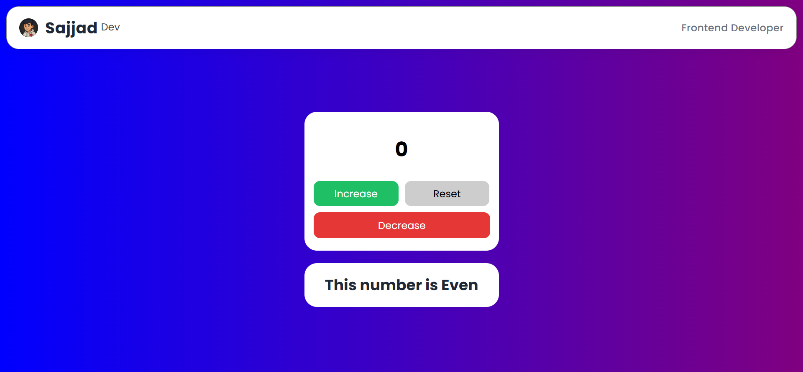

# 🧮 Counter App

<h1 align="center">Modern Counter Page</h1>

A simple and clean counter application built with HTML, CSS, and JavaScript.  
This app lets you increase, decrease, or reset the counter and also shows whether the current number is Odd or Even.

---

## 🔥 Features

- Increase the counter
- Decrease the counter
- Reset to zero
- Real-time Odd/Even detection
- Minimal and modern UI
- Fully responsive design

---

## 🛠️ Technologies Used

- HTML5
- CSS3
- JavaScript (DOM Manipulation)

---

## 📸 Preview

---

## 🚀 How It Works

The app uses a counter variable (x) and updates the UI on every button click.  
A function named updateOddEven() checks whether the current number is Odd or Even and updates the label accordingly.

---

## 📌 What I Learned

- Selecting elements with querySelector()
- Using addEventListener("click")
- Updating DOM text using textContent
- Writing reusable functions
- Conditional logic (if / else)
- Understanding execution order in JavaScript

---

## 📎 Live Demo

https://SajjadR17.github.io/counter-page/

---

## 🧭 How To Run Locally

`bash
git clone https://github.com/SajjadR17/counter-page.git
cd counter page
code .

---

## 🧾 License

This project is licensed under the MIT License — meaning you're free to use, modify, and share it,  
as long as you give proper credit to Sajjad Roohandeh.
